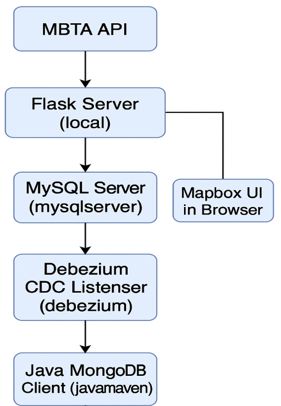

# mit_bus_tracking_app
This package, along with Docker containers, is used to build a web app that tracks route 1 between universities in Cambridge, MA. We then use [Mapbox](https://console.mapbox.com/) to visualize the bus movements.

# Requirements
## Data
Data is pulled via the [MBTA API](https://www.mbta.com/developers/v3-api).
## Docker Containers
You will need 4 docker containers:
- mysqlserver: A MySQL database container that stores parsed MBTA API data.
- some-mongo: A MongoDB container used for storing data captured via CDC (Change Data Capture).
- debeziumserver: A Java-based Debezium CDC engine that listens for changes in the MySQL database and pushes them to MongoDB.
- javamaven: A Java-based container used to query and verify the MongoDB CDC data.

## Local
- Flask server: A Flask web server that fetches real-time MBTA data, stores it in MySQL, and displays it on a Mapbox-powered UI.

## Interaction Flow

